 

 

## 👋 About

**Jaganmohan Reddy** — 2026 Electronics & Communication Engineering graduate who taught himself full-stack development, then went looking for the parts tutorials skip.

Started with the **MERN stack**, shipping complete applications end to end. Now going deeper into **Java backend engineering** — how reliable systems actually get built.

<table>
<tr><td>🎓</td><td><b>Education</b></td><td>B.E. Electronics & Communication Engineering — Graduated May 2026</td></tr>
<tr><td>💼</td><td><b>Focus</b></td><td>Full Stack Development · Java Backend Engineering</td></tr>
<tr><td>🔧</td><td><b>Building now</b></td><td>Seatline — concurrency-safe, real-time booking engine</td></tr>
<tr><td>🧭</td><td><b>Path</b></td><td>MERN → Full Stack → Java + JDBC + SQL → Spring Boot</td></tr>
</table>

**What I actually care about**

`Understanding WHY, not copying blind` · `Concurrency-safe systems` · `Testing failure paths` · `Code others can read`

 

## 🚀 Featured Project

### 🎟️ Seatline — Atomic Booking Engine
**A concurrency-safe, real-time seat booking system**

> **The problem:** what happens when many users try to book the same seat at the exact same instant?
> A naive check-then-write flow lets two requests both see "available" before either updates it. Seatline fixes this at the **database layer**, not with a frontend patch.

| Area | What's implemented |
|---|---|
| ⚛️ Atomicity | Single atomic MongoDB `findOneAndUpdate` — zero read/write gap to exploit |
| 🔑 Idempotency | Duplicate-click and network-retry-safe booking keys |
| 📡 Real-time | Socket.IO — every connected client updates instantly |
| 🔐 Auth | JWT with role-based organizer access |
| 🧪 Proof | Custom load test simulating concurrent bookings — verified, not assumed |

<b>Not:</b> "user clicked → seat booked."&nbsp;&nbsp;<b>Actually:</b> "many requests → one valid state → predictable result."

 

## 🧠 Current Focus

| Area | Exploring |
|---|---|
| ☕ Java | OOP, Collections, Exception Handling |
| 🔌 JDBC | Connections, PreparedStatement, Transactions |
| 🗄️ SQL | Joins, Subqueries, Aggregation, Schema Design |
| 🏗️ Architecture | DAO → Service → Controller layering |
| 🚀 Next | Spring Boot, production REST APIs |

 

## 🛠️ Tech Stack

 

## 📊 GitHub Analytics

 

## 🏆 Achievements

 

## 📬 Let's Connect

**Full Stack Developer · Java Backend Developer · Backend Engineer**

I'm looking for a role where I can contribute to real systems, learn from engineers ahead of me, and build things that hold up under real load — not just in a demo.

 

